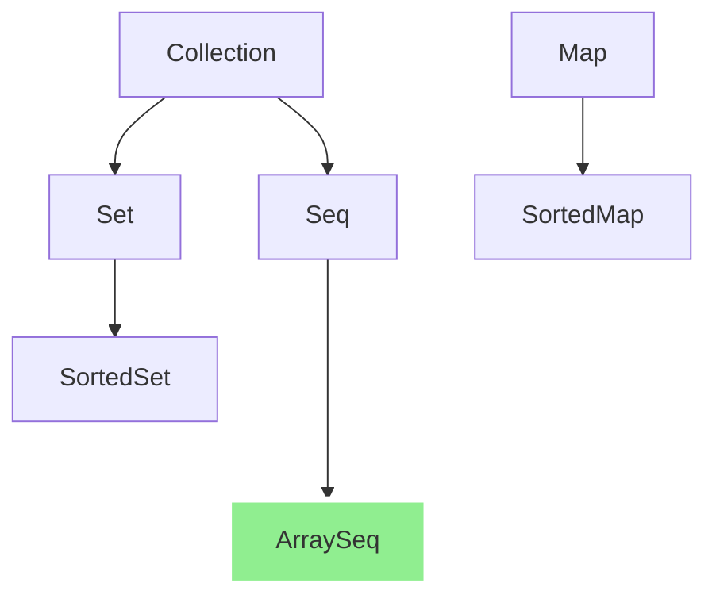
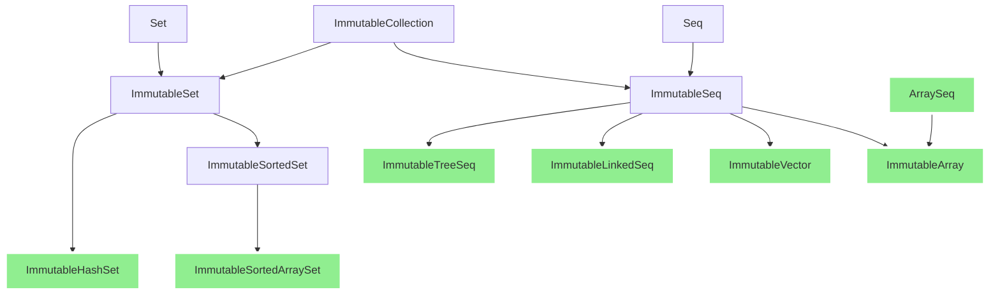
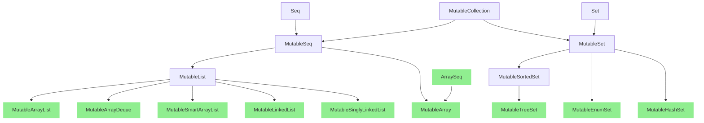

# Kala Common Tutorial

Table of contents:

* [Use Kala Collections](#use-kala-collections) (WIP)
* ... (WIP)

## Use Kala Collections

### Overview

Kala Collections provides the following common collection interfaces:

* `Collection`: Common interface implemented by collections.
  * `Seq`: An ordered collection of values that can be accessed by integer index.
  * `Set`: A collection that contains no duplicate elements.
    * `SortedSet`: A `Set` that further provides a total ordering on its elements.
* `Map`: An object that maps keys to values.

These collections have immutable and mutable variants.
For example, for `Seq`, it has the following important subinterfaces:

* `Seq`
  * `ImmutableSeq`: An immutable seq. The user cannot modify it, but can generate another seq from an existing seq.
  * `MutableSeq`: A mutable seq. It is similar to an array in that the user can modify this seq, but it does not provide methods that would change the size of the seq.
    * `MutableList`: It is a better alternative to `java.util.List` and provides more useful methods.

This is a diagram of the basic collection types:

Basic:


Immutable Collections:


Mutable Collections:



### Creating collections using factory methods

Most collection interfaces and implementation classes provide a series of convenient static factory methods
for creating collections.

```java
// Create a collection from values
var _ = Seq.of(1, 2, 3); // ==> [1, 2, 3]

// Create a collection from array
var _ = Seq.from(new Integer[] {1, 2, 3});  // ==> [1, 2, 3]

// Create a collection from any iterable object
var _ = Seq.from(java.util.List.of(1, 2, 3));  // ==> [1, 2, 3]

// Create a collection from an iterator
var _ = Seq.from(java.util.List.of(1, 2, 3).iterator());  // ==> [1, 2, 3]

// Create a collection from a stream
var _ = Seq.from(java.util.stream.Stream.of(1, 2, 3));  // ==> [1, 2, 3]

// Create a seq filled with N identical values
var _ = Seq.fill(3, "value"); // ===> ["value", "value", "value"]

// Create a seq of N values, each of which is generated by a user-supplied function
var _ = Seq.fill(3, i -> i + 10); // ===> [10, 11, 12]

// Wrap an existing java.util.List as a Seq (without copying)
var _ = Seq.wrapJava(List.of(1, 2, 3)); // ===> [1, 2, 3]
```

In addition, each collection class/interface provides a static `factory()` method 
to get a `CollectionFactory` corresponding to a collection.
The `CollectionFactory` instance also provides factory methods similar to the above and can be used as a `java.util.stream.Collector`.

```java
var _ = Seq.<Integer>factory().of(1, 2, 3); // ===> [1, 2, 3]

// Use as Collector
var _ = Stream.of(1, 2, 3).collect(Seq.factory()); // ===> [1, 2, 3]
```

More usage of `CollectionFactory` will be introduced in later chapters.

(WIP)