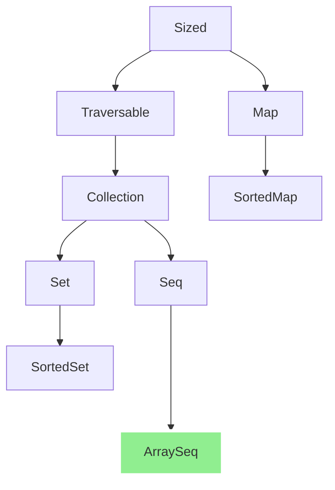
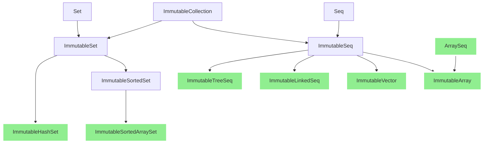
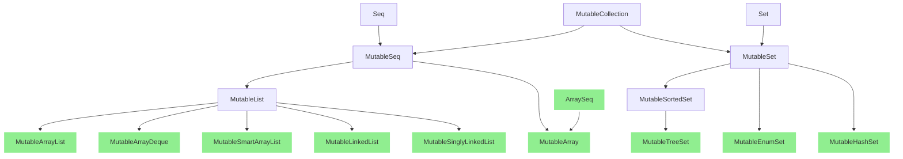

# Kala Common Tutorial

Table of contents:

* [Use Kala Collection](#use-kala-collection) (WIP)
* Use Kala Collection for primitive types (WIP)
* [Use reverse indexes in Kala Common](#use-reverse-indexes-in-kala-common)
* ... (WIP)

## Use Kala Collection

### Overview

Kala Collection provides the following common collection interfaces:

* `Traversable`: An Iterable with more functionality.
  * `Collection`: Common interface implemented by collections.
    * `Seq`: An ordered collection of values that can be accessed by integer index.
    * `Set`: A collection that contains no duplicate elements.
      * `SortedSet`: A `Set` that further provides a total ordering on its elements.
* `Map`: An object that maps keys to values.

These collections have immutable and mutable variants.
For example, for `Seq`, it has the following important subinterfaces:

* `Seq`
  * `ImmutableSeq`: An immutable seq. The user cannot modify it, but can generate another seq from an existing seq.
  * `MutableSeq`: A mutable seq. It is similar to an array in that the user can modify this seq, but it does not provide methods that would change the size of the seq.
    * `MutableList`: It is a better alternative to `java.util.List` and provides more useful methods.

This is a diagram of the basic collection types:

Basic:


Immutable Collections:


Mutable Collections:



### Creating collections using factory methods

Most collection interfaces and implementation classes provide a series of convenient static factory methods
for creating collections.

```java
// Create a collection from values
Seq<Integer> _ = Seq.of(1, 2, 3); // ==> [1, 2, 3]

// Create a collection from array
Seq<Integer> _ = Seq.from(new Integer[] {1, 2, 3});  // ==> [1, 2, 3]

// Create a collection from any iterable object
Seq<Integer> _ = Seq.from(java.util.List.of(1, 2, 3));  // ==> [1, 2, 3]

// Create a collection from an iterator
Seq<Integer> _ = Seq.from(java.util.List.of(1, 2, 3).iterator());  // ==> [1, 2, 3]

// Create a collection from a stream
Seq<Integer> _ = Seq.from(java.util.stream.Stream.of(1, 2, 3));  // ==> [1, 2, 3]

// Create a seq filled with N identical values
Seq<String> _ = Seq.fill(3, "value"); // ===> ["value", "value", "value"]

// Create a seq of N values, each of which is generated by a user-supplied function
Seq<Integer> _ = Seq.fill(3, i -> i + 10); // ===> [10, 11, 12]

// Wrap an existing java.util.List as a Seq (without copying)
Seq<Integer> _ = Seq.wrapJava(List.of(1, 2, 3)); // ===> [1, 2, 3]
```

In addition, each collection class/interface provides a static method `factory()` 
to get a `CollectionFactory` corresponding to a collection.
The `CollectionFactory` instance also provides factory methods similar to the above and can be used as a `java.util.stream.Collector`.

```java
Seq<Integer> _ = Seq.<Integer>factory().of(1, 2, 3); // ===> [1, 2, 3]

// Use as Collector
Seq<Integer>  _ = Stream.of(1, 2, 3).collect(Seq.factory()); // ===> [1, 2, 3]
```

More usage of `CollectionFactory` will be introduced in later chapters.

### Size Info

Similar to `java.util.Collection`, `Traversable` provides some basic methods for getting its size information:

* `int size()`: Returns the number of elements.
* `boolean isEmpty()`: Returns `true` if it contains no elements.
* `boolean isNotEmpty()`: Returns `true` if it contains elements.
* `int knownSize()`: Returns the number of elements if it can be obtained in constant time, otherwise returns `-1`.
* `int sizeCompare(int otherSize)`: Compares the size of this `Traversable` to `otherSize` and returns the result.
* `int sizeCompare(Iterable<?> other)`: Compares the size of this `Traversable` to `other` and returns the result.

The methods `knownSize` and `sizeCompare` are useful for some lazy collections.

### Stream Operations

Similar to `java.util.Collection`, `Traversable` provides some methods about `java.util.stream.Stream`.
Therefore, all collections in Kala Collection can work well with Java Stream.

* `Spliterator<T> spliterator()`
* `Stream<T> stream()`
* `Stream<T> parallelStream()`

### Transformation Operations

Kala Collection provides a rich API for converting one collection into another.

#### Mapping Operations

Kala provides a number of methods to map each element in a collection to one, zero, or more new elements.

The method `map` maps each element to a new element:

```java
Seq<Boolean> _ = Seq.of(1, 2, 3).map(value -> value % 2 == 0); // [false, true, false]
```

To apply a transformation that additionally uses the element index as an argument, use `mapIndexed`:

```java
Seq<Integer> _ = Seq.of(1, 2, 3).mapIndexed((index, value) -> value + index); // [1, 3, 5]
```

If you want to exclude `null` from the result, 
you can use the methods `mapNotNull` and `mapIndexedNotNull` to map each element to either zero or one:

```java
Seq<String> _ = Seq.of(1, 2, 3).mapNotNull(value -> value == 2 ? null : String.valueOf(value)); // ===> ["1", "3"]
Seq<String> _ = Seq.of(1, 2, 3).mapIndexedNotNull(
        (index, value) -> index == 0 ? null : String.valueOf(value)); // ["2", "3"]
```

If you want to map each element into any number of elements, 
you can use the method `mapMulti` or `flatMap`.

The method `mapMulti` accepts a mapper with two parameters, 
the first is the element, and the second one is a `Consumer`.
The `Consumer` can be called zero or more times within the mapper,
and each time the arguments passed to it become part of the result.

```java
Seq<String> _ = Seq.of(1, 2, 3).mapMulti((Integer value, Consumer<String> consumer) -> {
    for (int i = 0; i < value; i++) {
        consumer.accept(String.valueOf(value));
    }
}); // ===> ["1", "2", "2", "3", "3", "3"]
```

The method `flatMap` accepts a mapper that returns a collection,
and all elements in the result become part of the result:

```java
Seq<String> _ = Seq.of(1, 2, 3).flatMap(
        value -> Seq.fill(value, String.valueOf(value))); // ===> ["1", "2", "2", "3", "3", "3"]
```


(WIP)

## Use reverse indexes in Kala Common

There are many APIs in Kala Common that accept integer indexes, such as `Seq::get(int)`.

> [!NOTE]
> Currently all of these indexes are of type `int`, and we are planning to migrate them all to `long`.
> See [#77](https://github.com/Glavo/kala-common/issues/77) for more details.

Unlike most Java libraries, most of the Kala Common API accepts reverse indexes.
These parameters are marked with `@kala.index.Index`.

When the API receives a negative index `idx`, it calculates the actual index like this:

```java
int actualIdx = size() - ~idx;
```

Here are some examples using reverse indexes:

```java
var seq = Seq.of(1, 2, 3);

// Get the last element
var _ = seq.get(~1); // ===> 3

// Get a slice of Seq except the first element
var _ = seq.slice(1, ~0); // ===> [2, 3]

// Get a slice of Seq except the last element
var _ = seq.slice(0, ~1); // ===> [1, 2]
```

It is worth noting that Kala Common differs slightly from Python's List
in that it uses the `~` (Bitwise Complement Operator) to indicate reverse indexes.
This option has two significant advantages:

* We can use the `~0` to indicate the end of the seq;
* Some methods (such as `indexOf`) return `-1` for invalid indexes.
  If some APIs accepted `-1` as a valid index, it might confuse users.
  But `-1` is equal to `~0`, so there is no such confusion in Kala Common. 
  On the contrary, we can use this to simplify some code.
  For example:
  ```java
  StringSlice getKey(StringSlice value) {
      return StringSlice.of(value, 0, value.indexOf('=')).trim();
  }
  
  var _ = getKey("i"); // ===> "i"
  var _ = getPrefix("i = 10"); // ===> "i"
  ```