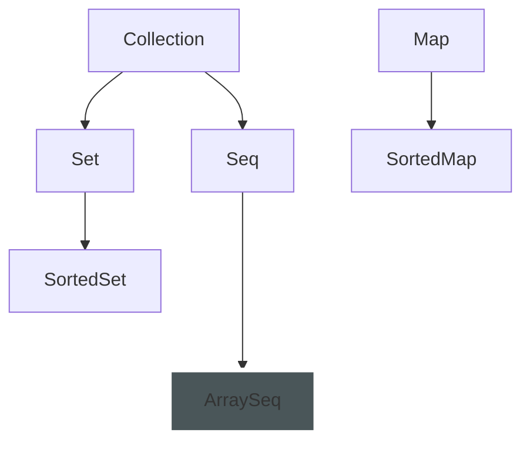
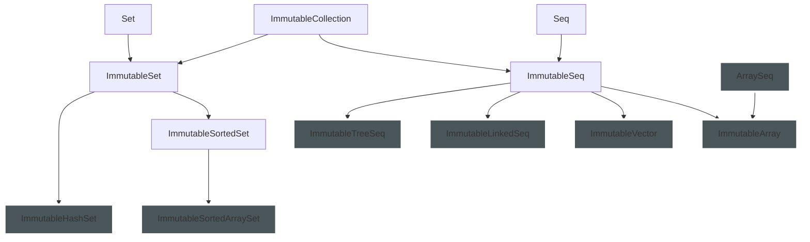
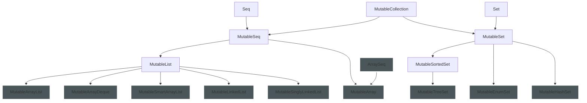

# Kala Common Tutorial

Table of contents:

* [Use Kala Collections](#use-kala-collections) (WIP)
* ... (WIP)

## Use Kala Collections

### Overview

Kala Collections provides the following common collection interfaces:

* `Collection`: Common interface implemented by collections.
  * `Seq`: An ordered collection of values that can be accessed by integer index.
  * `Set`: A collection that contains no duplicate elements.
    * `SortedSet`: A `Set` that further provides a total ordering on its elements.
* `Map`: An object that maps keys to values.

These collections have immutable and mutable variants.
For example, for `Seq`, it has the following important subinterfaces:

* `Seq`
  * `ImmutableSeq`: An immutable seq. The user cannot modify it, but can generate another seq from an existing seq.
  * `MutableSeq`: A mutable seq. It is similar to an array in that the user can modify this seq, but it does not provide methods that would change the size of the seq.
    * `MutableList`: It is a better alternative to `java.util.List` and provides more useful methods.

This is a diagram of the basic collection types:

Basic:

Immutable Collections:

Mutable Collections:

